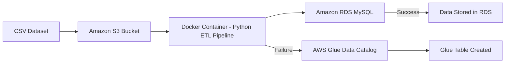

# 🚀 S3 → RDS Data Pipeline with AWS Glue Fallback (Dockerized)


---

# 📑 Table of Contents

- Project Overview
- Project Highlights
- Problem Statement
- Solution Architecture
- Data Pipeline Workflow
- Architecture Diagram
- Tech Stack
- AWS Services Used
- Deployment Architecture
- Project Structure
- Sample Dataset
- Requirements
- AWS Setup
- Environment Configuration
- Docker Configuration
- Pipeline Code
- Build and Run
- Error Handling Strategy
- Security Considerations
- Performance and Scalability
- Local Development Setup
- Screenshots
- Example Output
- Future Improvements
- Learning Outcomes
- Author
- License

---

# 📌 Project Overview

This project demonstrates a **cloud-based data ingestion pipeline** that reads a CSV dataset from **:contentReference[oaicite:0]{index=0}**, attempts to store the data in **:contentReference[oaicite:1]{index=1} (MySQL)**, and if the database fails, automatically creates a **metadata table in :contentReference[oaicite:2]{index=2} Data Catalog** as a fallback mechanism.

The pipeline runs inside a **Docker container on an EC2 instance**, simulating a **real-world DevOps and Data Engineering workflow**.

---

# ✨ Project Highlights

✔ Fault-tolerant data pipeline  
✔ Automatic fallback mechanism  
✔ Dockerized ETL process  
✔ Cloud-native AWS architecture  
✔ Production-style DevOps workflow  
✔ Demonstrates real-world failure handling  

---

# ❗ Problem Statement

In real-world data pipelines, database outages can interrupt ingestion workflows and lead to **data loss or processing failures**.

This project demonstrates a **fault-tolerant pipeline design** where the system:

- Attempts to load data into **:contentReference[oaicite:3]{index=3}**
- If the database fails
- Automatically switches to **:contentReference[oaicite:4]{index=4}** to register the dataset

This ensures **data availability even during infrastructure failures**.

---

# 🧠 Solution Architecture

The pipeline follows this architecture:

1. CSV dataset stored in **:contentReference[oaicite:5]{index=5}**
2. Docker container runs ETL pipeline
3. Data inserted into **:contentReference[oaicite:6]{index=6}**
4. If database fails → fallback to **:contentReference[oaicite:7]{index=7}**

---

# 🔄 Data Pipeline Workflow

1. Upload dataset to **:contentReference[oaicite:8]{index=8}**
2. Start Docker pipeline
3. Pipeline reads CSV from S3
4. Attempt insert into **:contentReference[oaicite:9]{index=9}**
5. If RDS fails → create table in **:contentReference[oaicite:10]{index=10}**

---

# 🏗️ Architecture Overview

```
CSV File
   │
   ▼
Amazon S3
   │
   ▼
Docker Container (Python ETL)
   │
   ├────────► Amazon RDS (MySQL)
   │               │
   │               ▼
   │         Data Stored
   │
   ▼
AWS Glue Data Catalog (Fallback)
```

---

# 📊 Architecture Diagram (Mermaid)



---

# 🧰 Tech Stack

| Category | Technology |
|--------|--------|
| Cloud Platform | AWS |
| Storage | Amazon S3 |
| Database | Amazon RDS MySQL |
| Data Catalog | AWS Glue |
| Programming | Python |
| Data Processing | Pandas |
| Containerization | Docker |
| Compute | EC2 |
| Version Control | Git / GitHub |

---

# ☁️ AWS Services Used

| Service | Purpose |
|------|------|
| Amazon S3 | Store CSV dataset |
| Amazon RDS | Store relational data |
| AWS Glue | Fallback metadata table |
| EC2 | Host Docker container |
| IAM | Manage permissions |
| Docker | Containerized pipeline execution |

---

# 🏗️ Deployment Architecture

- Dataset stored in **:contentReference[oaicite:11]{index=11}**
- Docker pipeline running on **:contentReference[oaicite:12]{index=12}**
- Database hosted on **:contentReference[oaicite:13]{index=13}**
- Metadata fallback stored in **:contentReference[oaicite:14]{index=14}**

---

# 📂 Project Structure

```
s3-rds-glue-data-pipeline
│
├── app.py
├── Dockerfile
├── requirements.txt
├── config.env
├── employees.csv
└── README.md
```

---

# 🧾 Sample Dataset

```
id,name,department,salary
1,John,IT,50000
2,Alice,HR,45000
3,Bob,Finance,55000
4,David,Marketing,48000
5,Sara,IT,52000
```

---

# ⚙️ Requirements

Before running the project:

- AWS Account
- Amazon S3 Bucket
- Amazon RDS MySQL Instance
- EC2 Instance (Ubuntu)
- Docker Installed
- Python 3.9+
- IAM user with AWS permissions

---

# ☁️ AWS Setup

## Create S3 Bucket

Example bucket:

```
data-ingestion-project-bucket
```

Upload file:

```
employees.csv
```

---

## Create RDS MySQL Database

Engine:

```
MySQL
```

Database:

```
companydb
```

Allow access from EC2 security group.

---

## IAM Permissions

Attach policies:

```
AmazonS3FullAccess
AmazonRDSFullAccess
AWSGlueConsoleFullAccess
```

---

# ⚙️ Environment Configuration

Create file:

```
config.env
```

Add configuration:

```
S3_BUCKET=data-ingestion-project-bucket
S3_KEY=employees.csv

RDS_ENDPOINT=your-rds-endpoint
RDS_USER=admin
RDS_PASSWORD=password
RDS_TABLE=employees

GLUE_DB=s3_fallback_db
GLUE_TABLE=employees_table
GLUE_S3_PATH=s3://data-ingestion-project-bucket/
```

---

# 🐳 Dockerfile

```
FROM python:3.11
WORKDIR /app
COPY requirements.txt .
RUN pip install --no-cache-dir -r requirements.txt
COPY app.py .
CMD ["python", "app.py"]
```

---

# 📦 requirements.txt

```
boto3
pandas
sqlalchemy
pymysql
```

---

# 🧠 Pipeline Code

```python
import os
import boto3
import pandas as pd
from sqlalchemy import create_engine

# Environment Variables
S3_BUCKET = os.getenv("S3_BUCKET")
S3_KEY = os.getenv("S3_KEY")

RDS_ENDPOINT = os.getenv("RDS_ENDPOINT")
RDS_USER = os.getenv("RDS_USER")
RDS_PASSWORD = os.getenv("RDS_PASSWORD")
RDS_DB = os.getenv("RDS_DB")
RDS_TABLE = os.getenv("RDS_TABLE")

GLUE_DB = os.getenv("GLUE_DB")
GLUE_TABLE = os.getenv("GLUE_TABLE")
GLUE_S3_PATH = os.getenv("GLUE_S3_PATH")

# AWS Clients
s3 = boto3.client("s3")
glue = boto3.client("glue")

def read_s3_csv():
    print("Reading CSV from S3...")
    obj = s3.get_object(Bucket=S3_BUCKET, Key=S3_KEY)
    df = pd.read_csv(obj["Body"])
    print(df.head())
    return df

def upload_to_rds(df):
    try:
        print("Connecting to RDS...")
        engine = create_engine(
            f"mysql+pymysql://{RDS_USER}:{RDS_PASSWORD}@{RDS_ENDPOINT}/{RDS_DB}"
        )

        print("Uploading data to RDS...")
        df.to_sql(RDS_TABLE, engine, if_exists="replace", index=False)

        print("Data successfully inserted into RDS")

    except Exception as e:
        print("RDS upload failed:", e)
        fallback_to_glue()

def fallback_to_glue():
    print("Falling back to AWS Glue")

    try:
        glue.create_table(
            DatabaseName=GLUE_DB,
            TableInput={
                "Name": GLUE_TABLE,
                "StorageDescriptor": {
                    "Columns": [
                        {"Name": "id", "Type": "int"},
                        {"Name": "name", "Type": "string"},
                        {"Name": "department", "Type": "string"},
                        {"Name": "salary", "Type": "int"}
                    ],
                    "Location": GLUE_S3_PATH,
                    "InputFormat": "org.apache.hadoop.mapred.TextInputFormat",
                    "OutputFormat": "org.apache.hadoop.hive.ql.io.HiveIgnoreKeyTextOutputFormat",
                    "SerdeInfo": {
                        "SerializationLibrary": "org.apache.hadoop.hive.serde2.lazy.LazySimpleSerDe",
                        "Parameters": {
                            "field.delim": ","
                        }
                    }
                },
                "TableType": "EXTERNAL_TABLE"
            }
        )

        print("Glue table created successfully")

    except Exception as e:
        print("Glue fallback failed:", e)

def main():
    df = read_s3_csv()
    upload_to_rds(df)

if __name__ == "__main__":
    main()
```

---

# 🐳 Build Docker Image

```
sudo docker build -t s3-rds-glue-pipeline .
```

---

# ▶️ Run Pipeline

```
sudo docker run --env-file config.env \
-e AWS_ACCESS_KEY_ID=YOUR_ACCESS_KEY \
-e AWS_SECRET_ACCESS_KEY=YOUR_SECRET_KEY \
-e AWS_DEFAULT_REGION=eu-north-1 \
s3-rds-glue-pipeline
```

---

# ⚠️ Error Handling Strategy

The pipeline implements **automatic failure handling**:

1. Attempt data insertion into **:contentReference[oaicite:15]{index=15}**
2. If connection fails
3. System switches to **:contentReference[oaicite:16]{index=16}**
4. Creates metadata table for dataset

This ensures **pipeline resilience and prevents data loss**.

---

# 🔐 Security Considerations

✔ AWS credentials stored in environment variables  
✔ IAM permissions used for resource access  
✔ Sensitive files excluded from repository  

---

# ⚡ Performance & Scalability

- Handles larger datasets from S3
- Easily scalable using AWS infrastructure
- Can be extended to distributed ETL workflows

---

# 💻 Local Development Setup

Clone repository

```
git clone https://github.com/yourusername/s3-rds-glue-data-pipeline.git
```

Navigate into project

```
cd s3-rds-glue-data-pipeline
```

Build Docker container and run pipeline.

---

# 📸 Screenshots

Screenshot 1 – S3 Bucket Upload  
Screenshot 2 – RDS Table Records  
Screenshot 3 – AWS Glue Table (Fallback Scenario)  
Screenshot 4 – Docker Container Logs  
Screenshot 5 – RDS Failure → AWS Glue Fallback  

---

# 🧪 Example Output

Successful execution

```
Reading CSV from S3
Connecting to RDS
Uploading data to RDS
Data successfully inserted into RDS
```

Fallback execution

```
RDS upload failed
Falling back to AWS Glue
Glue table created successfully
```

---

# 🚀 Future Improvements

- CI/CD pipeline using GitHub Actions
- Infrastructure automation using Terraform
- CloudWatch monitoring and alerts
- Retry mechanism for database failures

---

# 🎯 Learning Outcomes

✔ AWS cloud architecture  
✔ Docker containerization  
✔ Python ETL pipeline development  
✔ Fault-tolerant system design  
✔ DevOps deployment workflows  

---

# 👨‍💻 Author

DevOps & Cloud Engineering Project

## 📩 Connect With Me :-

If you’d like to collaborate, discuss projects, or just say hello — feel free to reach out!  

### 🔗 Social & Professional Links
- 🌐 [Portfolio Website](https://prasad-bhoite19.github.io/prasad-portfolio/)  
- 💼 [LinkedIn](http://linkedin.com/in/prasad-bhoite-a38a64223)  
- 🐙 [GitHub](https://github.com/Prasad-bhoite19)  
- ✉️ [Email](prasadsb2002@gmail.com)  

💬 Always open for opportunities in **Cloud, DevOps, and Full-Stack Projects**

---

# 📜 License

MIT License
